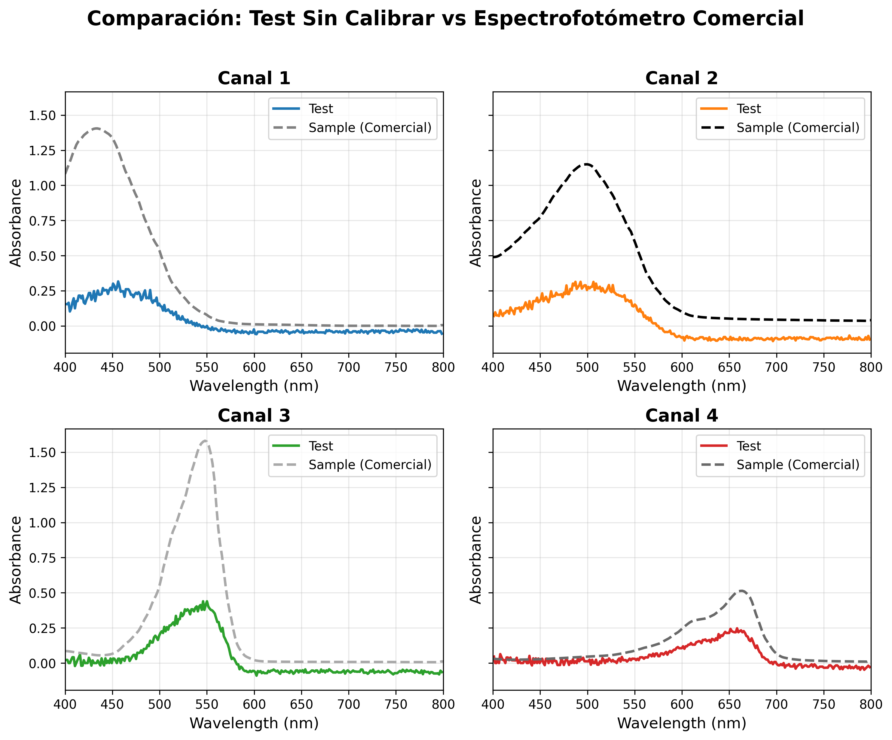
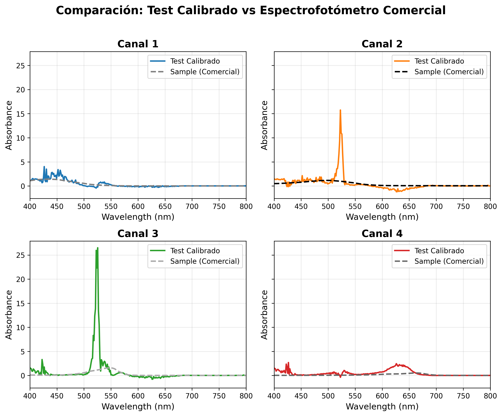
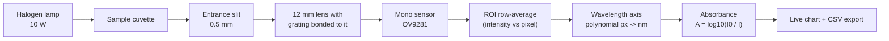

<h1 align="center">MonoSpectro</h1>

<p align="center">
  <b>An open-source visible-light spectrophotometer built around a monochrome Raspberry Pi camera —<br>
  and calibrated until it agrees with a commercial lab instrument.</b>
</p>

<p align="center">
  
  
  
  
</p>

<!-- TODO: hero photo of the finished instrument -> docs/images/hero.jpg
<p align="center"></p>
-->

---

## What this is

MonoSpectro turns a monochrome Raspberry Pi camera and a 1000 lines/mm transmission
grating into a working **absorbance spectrophotometer** for the visible range. Light
passes through the sample, is dispersed across the camera sensor, and a browser
interface reads out the spectrum live, lets you take a blank reference, and exports
absorbance as CSV.

The interesting part is not the optics — plenty of DIY spectrometers exist. It is the
**calibration pipeline**: MonoSpectro maps its own pixel/intensity space onto the
wavelength and absorbance scale of a reference instrument, so the numbers it produces
are comparable to a real lab spectrophotometer instead of being arbitrary units.

| | |
| --- | --- |
| **Validated range** | 400–800 nm against a commercial spectrophotometer |
| **Sensor** | 1280×720 monochrome, global shutter, 8-bit |
| **Grating** | 1000 lines/mm transmission film, first order |
| **Detector** | Camera-based — no moving parts, whole spectrum captured at once |
| **Readout** | Live web interface on the local network |
| **Cost** | Roughly two orders of magnitude below the reference instrument |

## Does it actually work?

Yes — after calibration. The same set of samples was measured on MonoSpectro and on a
commercial spectrophotometer. Solid lines are MonoSpectro, dashed black is the
reference instrument.

**Before calibration** — the peaks are there, the scale is not:

<p align="center">
  
</p>

**After calibration** — the corrected curves track the reference across the band:

<p align="center">
  
</p>

Test set: methylene blue, rhodanine, Congo red and a brilliant-blue dilution, measured
against a commercial reference instrument. Reproduce the figures yourself with
[`tools/compare_reference.py`](tools/compare_reference.py).

## How it works



1. **Capture** — `picamera2` streams frames from the monochrome sensor. No Bayer
   interpolation stands between the light and the numbers, which is the main reason for
   choosing a mono camera over a colour one.
2. **ROI** — you draw a rectangle over the spectral line. Every column inside it is
   averaged vertically, giving one intensity value per pixel column.
3. **Wavelength axis** — a 1st or 2nd degree polynomial maps pixel position to
   nanometres. Coefficients live in `calibration.json`.
4. **Absorbance** — capture a blank (`Blanco`) to store *I₀*, then every subsequent
   frame is reported as `A = log10(I₀ / I)`.
5. **Export** — `Guardar Abs` downloads a CSV with `Pixel, Wavelength_nm, abs`.

## Hardware

<!-- TODO: exploded CAD render from Fusion -> docs/images/cad_exploded.png
<p align="center"></p>
-->

| Part | Spec | Notes |
| --- | --- | --- |
| Camera | [Arducam OV9281](https://eu.robotshop.com/products/arducam-ov9281-1mp-mono-global-shutter-noir-mono-mipi-camera-raspberry-pi) — 1 MP mono, global shutter, NoIR, MIPI | True monochrome sensor: every pixel is an unfiltered intensity reading |
| Lens | 12 mm M12 | Chosen over 3 / 3.6 / 6 mm — the narrow field spreads the first order across the full sensor |
| Grating | [Edmund Optics #4621](https://www.edmundoptics.eu/p/25400-linesinch-6quot-x-12quot-sheets-2pack/4621/) — 25,400 lines/inch ≈ **1000 lines/mm** | Transmission film, cut from a 6"×12" sheet and **bonded directly to the lens** |
| Grating angle | 36° to the incident beam | Places the mid-band on the optical axis |
| Entrance slit | 0.5 mm wide | Sets the spectral resolution together with the dispersion |
| Slit → camera | 50 mm | No collimating optics between them |
| Light source | 10 W halogen lamp | Continuous spectrum across the visible band |
| Cuvette | Standard 10 mm path length | Ordinary lab cuvettes — nothing custom |
| Computer | Raspberry Pi 4 | Runs the Flask app and the camera stack |
| Enclosure | 3D printed, designed in Fusion 360 | Designs in [`hardware/`](hardware/) |

> CAD sources are designed in Fusion 360. Exported STEP/STL files live in
> [`hardware/`](hardware/) so you can print them without a Fusion licence.
> <!-- TODO: export STEP + STL into hardware/ and list them here -->

### Optical layout

There is no collimator. The grating sits directly on the lens, and the 0.5 mm slit at
50 mm does the work of defining the beam — a deliberately simple geometry that trades
some throughput for a build anyone can reproduce without an optical bench.

For a 1000 lines/mm grating at normal incidence, the first order lands at:

| λ | 400 nm | 500 nm | 600 nm | 700 nm | 800 nm |
| --- | --- | --- | --- | --- | --- |
| diffraction angle | 23.6° | 30.0° | 36.9° | 44.4° | 53.1° |

which is why 36° puts the middle of the visible band on the camera axis and a 12 mm
lens — rather than a wider one — keeps the whole first order on the sensor.

Two things matter more than optical precision here:

- **Light-tightness.** Any stray light reaching the sensor raises the floor of *I* and
  flattens your absorbance peaks. Print the body in opaque filament.
- **The sensor is 8-bit.** Intensity saturates at 255, so set exposure and gain to put
  the brightest part of the blank near — but not at — that ceiling.

> **Known limitation:** the NoIR camera carries no IR-cut filter and the sensor responds
> out to roughly 1000 nm, so near-infrared leaks into the measurement. A BG38 or UG11
> filter would fix it. This build does not have one.

## Install

On the Raspberry Pi (tested on Raspberry Pi OS *trixie*, Python 3.13):

```bash
# picamera2 comes from the OS, not from pip
sudo apt update && sudo apt install -y python3-picamera2

git clone https://github.com/alexmanuel27/MonoSpectro.git
cd MonoSpectro

python3 -m venv venv --system-site-packages   # so the venv can see picamera2
source venv/bin/activate
pip install -r requirements.txt

cp calibration.example.json calibration.json  # placeholder until you calibrate
python app.py
```

`--system-site-packages` is not optional: `picamera2` is not installable from PyPI, so
an isolated virtualenv cannot see the camera at all.

Then open `http://<your-pi-address>:5000` from any machine on the same network.

For the desktop-side analysis tools:

```bash
pip install -r tools/requirements.txt
```

## Using it

1. **Frame the spectrum.** Adjust exposure and gain in the sidebar until the spectral
   line is bright but not clipped, then set the ROI (`x;y` for the top-left and
   bottom-right corners) so the green box hugs the line.
2. **Calibrate the wavelength axis** (one of the two methods below).
3. **Take a blank.** Fill the cuvette with your solvent, press `Blanco`.
4. **Measure.** Swap in the sample, press `Guardar Abs` to download the spectrum.

### Calibration method 1 — known peaks

Enable `Calibrar Picos`, click on a peak in the live chart, and type its known
wavelength. Two points give a linear fit; four or more switch to a quadratic. Good
sources of known lines: a compact fluorescent lamp (mercury lines at 436, 546 and
611 nm) or any laser pointer with a specified wavelength.

### Calibration method 2 — sample sync against a reference instrument

Press `Sincronizar` and upload pairs of files: your own exported CSV alongside the
same sample measured on a reference spectrophotometer. MonoSpectro finds the
absorbance maximum in each (smoothed with a 25-point rolling mean), pairs
*your pixel* with *their nanometre*, and fits the axis to it. Six or more pairs
enable the quadratic fit; a sanity check rejects any fit that maps pixel 600 outside
200–1100 nm.

## Data format

Exported spectra:

```csv
Pixel,Wavelength_nm,abs
100.00,401.23,0.0389
101.00,402.31,0.0512
```

`calibration.json` holds the pixel→nm polynomial, highest degree first:

```json
{"coeffs": [0.000378, 1.0814, 41.377]}
```

This file is **device-specific** and gitignored — yours will differ from the example.

## Repository layout

```
├── app.py                     # Flask server: camera stream, spectrum, calibration
├── templates/index.html       # Web interface
├── static/                    # Front-end logic and styling
├── tools/
│   └── compare_reference.py   # Validate against a reference instrument
├── hardware/                  # 3D-printable enclosure (STEP / STL)
├── docs/images/               # Figures and photos
└── calibration.example.json   # Starting point for your own calibration
```

Raw measurement data is deliberately **not** tracked in this repository — only the
processed figures are.

## Roadmap

- [ ] Publish the enclosure CAD (STEP + STL) and a full bill of materials
- [ ] Fluorescence mode — blue LED excitation for chlorophyll (~450 nm in, ~685 nm out),
      which is what this instrument was built for
- [ ] IR-cut filter (BG38 / UG11) to stop NIR leakage through the NoIR sensor
- [ ] Dark-frame subtraction to compensate sensor noise at long exposures
- [ ] Save/load named calibration profiles instead of a single global file
- [ ] Store measurement sessions server-side instead of one-shot CSV downloads
- [ ] Transmittance and concentration (Beer–Lambert) readouts
- [ ] English translation of the web interface

## Contributing

Issues and pull requests are welcome — especially calibration data from other builds,
alternative gratings, and enclosure remixes. If you build one, open an issue with
photos and your calibration coefficients; a comparison across builds would be far more
useful than a single unit's numbers.

## License

[MIT](LICENSE) © Alex Manuel Rivera

## Disclaimer

MonoSpectro is a hobbyist and educational instrument. It is not certified for
clinical, diagnostic, food-safety, environmental-compliance or any other regulated
analytical use.
