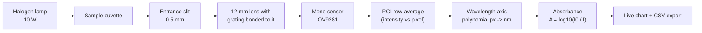
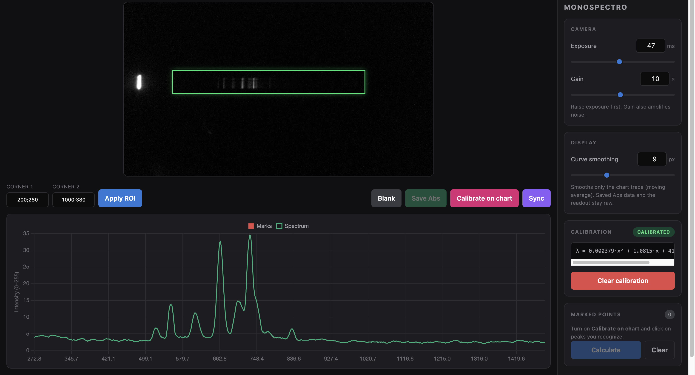
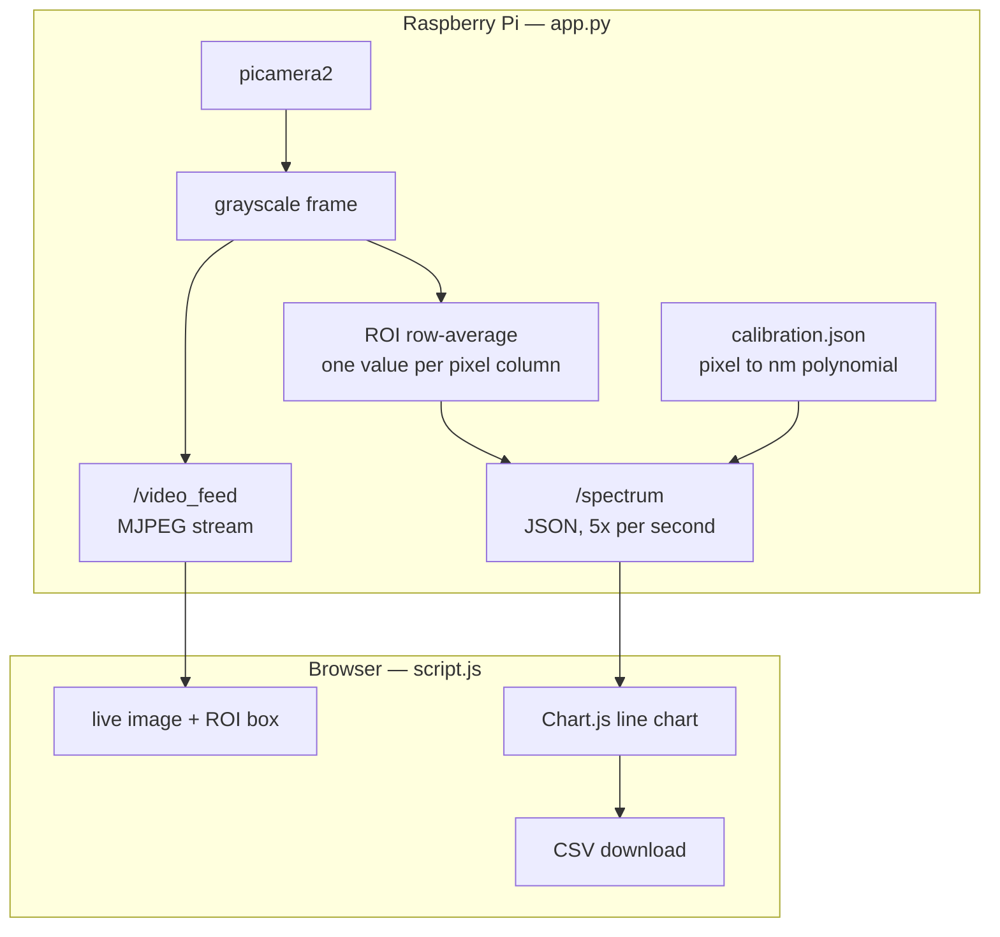
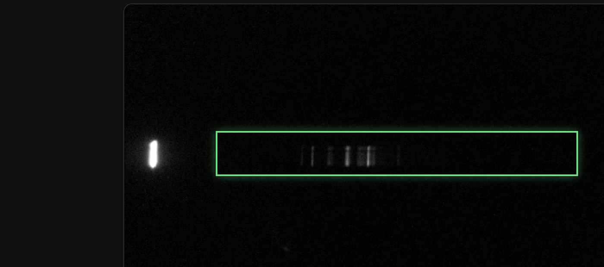
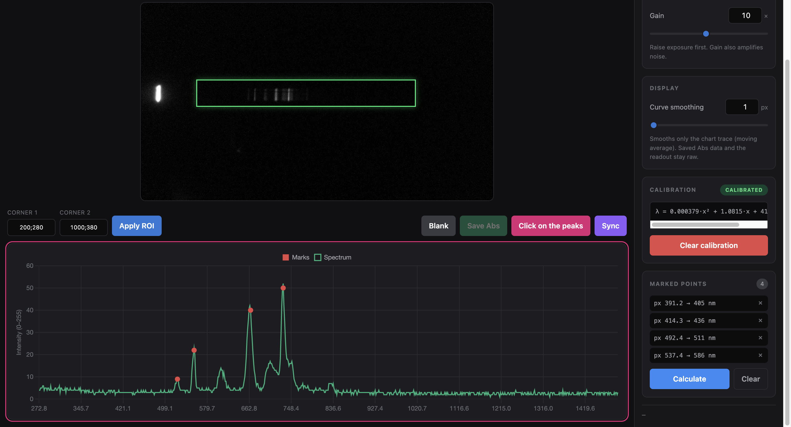

<h1 align="center">MonoSpectro</h1>

<p align="center">
  <b>An open-source visible-light spectrophotometer built around a monochrome Raspberry Pi camera,<br>
  with a calibration validated against a commercial lab instrument on samples it had never seen.</b>
</p>

<p align="center">
  
  
  
  
</p>

<!-- TODO: hero photo of the finished instrument -> docs/images/hero.png
<p align="center"></p>
-->

---

## What this is

MonoSpectro turns a monochrome Raspberry Pi camera and a 1000 lines/mm transmission
grating into a working **absorbance spectrophotometer** for the visible range. Light
passes through the sample, is dispersed across the camera sensor, and a browser
interface reads out the spectrum live, lets you take a blank reference, and exports
absorbance as CSV.

It exists for a specific job: **measuring chlorophyll in water from a buoy**. That
constraint drives every design decision here — it has to be cheap enough to leave
outdoors, run unattended off a Raspberry Pi, and be serviced by whoever is on the boat
that day. A lab spectrophotometer is none of those things.

The interesting part is therefore not the optics — plenty of DIY spectrometers exist.
It is the **calibration pipeline**: MonoSpectro maps its own pixel/intensity space onto
the wavelength and absorbance scale of a reference instrument, so the numbers it
produces are comparable to a real lab spectrophotometer instead of being arbitrary
units.

### Where this is going

The end goal is a **spectrofluorometer** in a cross-shaped geometry: a cuvette with four
optical faces, the horizontal axis carrying a white LED and this monochrome camera for
absorbance, and the vertical axis carrying excitation LEDs — a 430 nm blue for
chlorophyll — with an 18-channel AS7265x sensor reading the fluorescent emission at
right angles to the excitation beam.

That split is deliberate. Earlier work compared three low-cost platforms (an 18-channel
AS7265x sensor, a Paton Hawksley pocket spectroscope, and a Little Garden
spectrometer) and found the discrete sensor reproducible and robust but coarse, while
imaging systems gave far better spectral fidelity. It also found a strong dependence on
the light source: **imaging systems want a halogen lamp** (continuous spectrum), while
**the AS7265x is more stable under white LEDs**. Each half of the instrument therefore
plays to its own strength — camera for spectral shape, discrete sensor for sensitive
fluorescence quantification.

The camera side is what this repository covers. It is the part that is built.

| | |
| --- | --- |
| **Validated range** | 420–780 nm, held-out validation against a K Lab Alpha |
| **Sensor** | 1280×720 monochrome, global shutter, 8-bit |
| **Grating** | 1000 lines/mm transmission film, first order |
| **Detector** | Camera-based — no moving parts, whole spectrum captured at once |
| **Readout** | Live web interface on the local network |
| **Calibration** | Joint Chebyshev response function, 51 % held-out error reduction |

## Does it actually work?

Yes, on samples it has never seen.

The correction was fitted on **nine food colourings** measured in April, and then tested
once on **four laboratory dyes** measured in May — a different session, a different
optical configuration, and a completely different set of chemicals. Nothing from the
test set touched the fit.

<p align="center">
  
</p>

| Held-out sample | RMSE uncorrected | RMSE corrected | Change |
| --- | --- | --- | --- |
| Bromothymol blue | 0.440 | 0.188 | −57 % |
| Congo red | 0.440 | 0.249 | −43 % |
| Rhodamine B | 0.389 | 0.157 | −60 % |
| Methylene blue | 0.116 | 0.086 | −25 % |
| **Mean** | **0.346** | **0.170** | **−51 %** |

The curve MonoSpectro records is pixel-noisy, and the correction above is applied
pointwise — `a(λ)·A_diy(λ) + b(λ)` at every wavelength — so any noise in the raw
spectrum rides straight through it, and can come out amplified wherever the gain
`a(λ)` exceeds 1. Both sides now go through a Savitzky-Golay filter (25 nm window)
before fitting or applying the model — the input, not the fitted curve — which is
why the corrected trace in the figure above is smooth rather than jagged. The window
was chosen the same way as everything else here: swept from 9 to 45 nm and scored on
the held-out set, not picked by eye — RMSE improves out to 35 nm and then turns back
up, with 25–35 nm visually indistinguishable, so 25 nm is the smallest window that
reaches the plateau.

Reproduce it with
[`tools/calibration_transfer.py`](tools/calibration_transfer.py); the reference
instrument is a **K Lab Alpha**, following the standardised solution protocol developed
by Dr. Dayaris Hernández and Dr. Aramis Rivera.

> When the held-out set is a single multi-column file rather than one file per sample,
> the script no longer trusts that column *i* in your export is column *i* in the
> reference export — instruments save columns in whatever order the operator scanned
> that day, and nothing forces the two files to agree. It re-pairs the two sides by
> whichever assignment of columns maximises correlation, and prints the match and its
> correlation for every sample so a genuinely bad reading — not a shuffled column — is
> still visible.

Every sample improves now, including Methylene blue — which is new. Earlier versions of
this correction let the wavelength curve flex freely and it dragged Methylene blue's
already-good match toward the average behaviour of the training set. Forcing that curve
to be simple, below, fixed it.

### Same table as the reference paper

Rivera-Rivera et al. (the same paper `ChebyshevResponse` above is drawn from) score
their three platforms with
R², its adjusted counterpart, the pooled sample size and the coefficient count (their
Table 3) rather than RMSE. Computed the same way — R² adjusted with `p = 1`, the order
of the calibration polynomial, exactly as in their formula — on this same held-out set:

| Platform | R² | R²_adj | n | Nc | SD (AU) | CV (%) |
| --- | --- | --- | --- | --- | --- | --- |
| MonoSpectro, uncorrected | 0.149 | 0.149 | 1444 | 0 | n/a | n/a |
| MonoSpectro, ResponseFunction | 0.715 | 0.715 | 1444 | 722 | n/a | n/a |
| MonoSpectro, ChebyshevResponse | 0.800 | 0.800 | 1444 | 4 | n/a | n/a |

`n` is every (wavelength, held-out sample) pair pooled into one R² — 361 wavelengths
(420–780 nm) × 4 samples. `Nc` is the total number of fitted coefficients: 0 for the raw
signal, 2 per wavelength for ResponseFunction (722 = 2 × 361), and 4 in total for
ChebyshevResponse (degree 1: two coefficients each for `a(λ)` and `b(λ)`, shared across
the whole range) — the same contrast the paper draws between its compact joint fit and
"882 unrelated" per-wavelength ones. **SD and CV are not in this table because
MonoSpectro doesn't have the data for them yet**: the paper's numbers come from 100
repeated measurements per dye, and this project currently records one spectrum per dye
per session. Reported here as `n/a` rather than a made-up number — those two columns
would need a repeatability run (same cuvette, same dye, ~100 re-readings) before they
mean anything.

Printed by the same script — `tools/calibration_transfer.py` — right after the RMSE
table above; run it yourself to see all three rows recomputed live.

### What the correction is

A per-wavelength linear response function:

```
A_ref(λ) = a(λ)·A_diy(λ) + b(λ)
```

`tools/calibration_transfer.py` fits two versions of it and keeps whichever scores
lower on the held-out set:

- **ResponseFunction** — gain and offset fitted independently at every wavelength from
  the paired measurements, then smoothed along the wavelength axis with a
  Savitzky-Golay filter so the two curves stay physical instead of tracking sample
  noise. Fit and smoothing are two separate steps.
- **ChebyshevResponse** — the same `a(λ)` and `b(λ)`, but expanded in a Chebyshev basis
  and fitted in a single joint least-squares pass across every wavelength and every
  training sample at once, so the smoothness is built into the model rather than
  applied afterwards. Same structure used for the Raspberry Pi platform in
  Rivera-Rivera et al., *Low-Cost Spectrophotometers: A Comparative Evaluation of
  Open-Source Architectures*.

The Chebyshev degree is fixed at **1** — a(λ) and b(λ) are straight lines in
wavelength, not a free-form curve — rather than chosen from a wide range by
leave-one-out. The [shape check](#spectral-shape-separately) below already shows
MonoSpectro's raw spectra track the reference's shape closely (r² of 0.98, 0.95, 0.92
and 0.89 fitting one scalar gain per sample); nothing in the optics motivates a(λ) or
b(λ) to have a complicated shape of their own, only a gentle drift with wavelength.
Letting leave-one-out pick the degree freely confirmed this from the other direction:
higher degrees won narrowly on the training score, which has every incentive to reward
extra flexibility, and then generalised *worse* to the held-out set — degree 1 is not
the LOO-optimal choice on paper, it is the one that actually held up, which is exactly
the failure mode LOO with too many hyperparameters to search is prone to on nine
samples. The wavelength range is still chosen by leave-one-out on the training set
alone, same as ResponseFunction; only the degree is fixed by this argument instead of
searched.

Two or four coefficients per wavelength (ResponseFunction) against four numbers shared
across the whole range (ChebyshevResponse) — either way, that is the whole model.

### Why not something cleverer

An earlier attempt used PLS regression to map a whole MonoSpectro spectrum onto a whole
reference spectrum. Trained on the same nine pairs and evaluated under the same
protocol, it reduced the held-out error by **4 %**, against ~50 % for the per-wavelength
response function above.

A second attempt regularised the per-wavelength fit toward the identity map
(`a=1, b=0`), on the theory that wavelengths with little training support should default
to trusting the instrument rather than to whatever the noise says. Chosen honestly by
leave-one-out on the training set, the best amount of regularisation turned out to be
none for that model — a symptom of the same underlying problem the fixed-degree
Chebyshev fit above solves more directly, by not giving the wavelength curve the
freedom to need reining in.

The reason is worth understanding before you try it yourself. A spectrum-to-spectrum
regression learns the *shapes it was trained on*. Nine samples cannot span the space of
things you might put in a cuvette, so on new chemistry it interpolates between
memorised shapes and gets it wrong. The response function instead learns a property of
the **instrument** — how far its absorbance reading deviates at each wavelength — and
that property does not care what is in the cuvette.

It is also easy to fool yourself here. The same PLS model scored on its own training
data reaches an RMSE of 0.0000 with enough components: with nine samples and eight
latent variables it can reproduce its inputs exactly. That number means nothing. Always
print the do-nothing baseline next to any model score.

### Spectral shape, separately

Independently of the absorbance scale, the *shape* MonoSpectro records tracks the
reference closely. Fitting a single linear factor per sample on the four May dyes gives
r² of 0.98, 0.95, 0.92 and 0.89, with three of the four peak positions within 6 nm
([`tools/compare_reference.py`](tools/compare_reference.py) reproduces this). Getting the
bands in the right place with the right widths is the hard part of building a
spectrometer; the absorbance scale is what the response function then fixes.

## How it works



1. **Capture** — `picamera2` streams frames from the monochrome sensor. No Bayer
   interpolation stands between the light and the numbers, which is the main reason for
   choosing a mono camera over a colour one.
2. **ROI** — you draw a rectangle over the spectral line. Every column inside it is
   averaged vertically, giving one intensity value per pixel column.
3. **Wavelength axis** — a 1st or 2nd degree polynomial maps pixel position to
   nanometres. Coefficients live in `calibration.json`.
4. **Absorbance** — capture a blank (`Blank`) to store *I₀*, then every subsequent
   frame is reported as `A = log10(I₀ / I)`.
5. **Export** — `Save Abs` downloads a CSV with `Pixel, Wavelength_nm, abs`.

## Hardware

<p align="center">
  
</p>

| Part | Spec | Notes |
| --- | --- | --- |
| Camera | [Arducam OV9281](https://eu.robotshop.com/products/arducam-ov9281-1mp-mono-global-shutter-noir-mono-mipi-camera-raspberry-pi) — 1 MP mono, global shutter, NoIR, MIPI | True monochrome sensor: every pixel is an unfiltered intensity reading |
| Lens | 12 mm M12 | Chosen over 3 / 3.6 / 6 mm — the narrow field spreads the first order across the full sensor |
| Grating | [Edmund Optics #4621](https://www.edmundoptics.eu/p/25400-linesinch-6quot-x-12quot-sheets-2pack/4621/) — 25,400 lines/inch ≈ **1000 lines/mm** | Transmission film, cut from a 6"×12" sheet and **bonded directly to the lens** |
| Camera tilt | 36° from the slit axis | Places the middle of the visible band on the optical axis |
| Entrance slit | 0.5 mm wide | Sets the spectral resolution together with the dispersion |
| Slit → camera | 5 mm | No collimating optics between them |
| Light source | 10 W halogen lamp | Continuous spectrum across the visible band |
| Cuvette | Standard 10 mm path length | Ordinary lab cuvettes — nothing custom |
| Computer | Raspberry Pi 4 | Runs the Flask app and the camera stack |
| Enclosure | 3D printed, designed in Fusion 360 | Designs in [`hardware/`](hardware/) |

> CAD sources are designed in Fusion 360. Exported STEP/STL files live in
> [`hardware/`](hardware/) so you can print them without a Fusion licence.
> <!-- TODO: export STEP + STL into hardware/ and list them here -->

### Optical layout

<p align="center">
  
</p>

There is no collimator. The grating sits directly on the lens, and the 0.5 mm slit at
5 mm does the work of defining the beam — a deliberately simple geometry that trades
some throughput for a build anyone can reproduce without an optical bench.

For a 1000 lines/mm grating at normal incidence, the first order lands at:

| λ | 400 nm | 500 nm | 600 nm | 700 nm | 800 nm |
| --- | --- | --- | --- | --- | --- |
| diffraction angle | 23.6° | 30.0° | 36.9° | 44.4° | 53.1° |

which is why tilting the camera 36° puts the middle of the visible band on its axis, and a 12 mm
lens — rather than a wider one — keeps the whole first order on the sensor.

Two things matter more than optical precision here:

- **Light-tightness.** Any stray light reaching the sensor raises the floor of *I* and
  flattens your absorbance peaks. Print the body in opaque filament.
- **The sensor is 8-bit.** Intensity saturates at 255, so set exposure and gain to put
  the brightest part of the blank near — but not at — that ceiling.

> **Known limitation:** the NoIR camera carries no IR-cut filter and the sensor responds
> out to roughly 1000 nm, so near-infrared leaks into the measurement. A BG38 or UG11
> filter would fix it. This build does not have one.

## Known deviations, and why they happen

The wavelength axis is systematically wrong at the blue end and close to right
everywhere else. Against the reference instrument the error runs to tens of nanometres
below 500 nm and settles to roughly 5 nm across green and red. That pattern is not
random noise, and three coupled causes account for it.

**1. The grating is not linear, and the first calibration assumed it was.**
For a transmission grating the first-order maxima follow

```
m·lambda = d·(sin(theta_i) + sin(theta_m))
```

Because the diffraction angle enters through a sine, projecting the spectrum onto a
*flat* sensor makes wavelength a non-linear function of pixel position — and the higher
the line density, the worse it gets. At 1000 lines/mm the non-linearity is most severe
in the blue. The original calibration fitted a straight line, which cannot describe
that. A second-order fit from at least three known lines — the mercury peaks of a
compact fluorescent lamp — is the minimum honest model.

**2. The lens distorts the image.**
The grating is bonded to a commercial M12 lens that was never designed for
spectroscopy, so it carries barrel or pincushion distortion. Real pixel position
deviates radially from the ideal:

```
x' = x·(1 + k1·r^2 + k2·r^4)
```

The effect is worst at the sensor edges — exactly where the blue end of the spectrum
lands. Two ways out: characterise the distortion with a grid target and undo it in
OpenCV before extracting the spectrum, or drop the lens entirely and mount the bare
CMOS sensor against the body with the grating as the only optical element.

**3. The tilted sensor changes magnification across the spectrum.**
With the camera tilted 36°, different wavelengths travel slightly different optical
path lengths to reach the sensor, so the system's effective magnification is not
constant across the spectrum width. A rational function

```
lambda = (A + B·x) / (1 + C·x)
```

fitted by least squares approximates that trigonometry better than a quadratic, because
it can bend asymptotically the way the geometry actually does.

None of these is fixed yet. They are written down because anyone reproducing this build
will meet the same three problems, and knowing which one you are looking at is most of
the work.

## Install

On the Raspberry Pi (tested on Raspberry Pi OS *trixie*, Python 3.13):

```bash
# picamera2 comes from the OS, not from pip
sudo apt update && sudo apt install -y python3-picamera2

git clone https://github.com/alexmanuel27/MonoSpectro.git
cd MonoSpectro

python3 -m venv venv --system-site-packages   # so the venv can see picamera2
source venv/bin/activate
pip install -r requirements.txt

cp calibration.example.json calibration.json  # placeholder until you calibrate
python app.py
```

`--system-site-packages` is not optional: `picamera2` is not installable from PyPI, so
an isolated virtualenv cannot see the camera at all.

Then open `http://<your-pi-address>:5000` from any machine on the same network. The Pi
can also serve as its own access point, so the instrument needs no infrastructure in the
field — see *Running it as a field instrument* below for that and for the systemd unit
that starts it on boot. Chart.js is vendored in `static/`, so the interface works with no
route to the internet.

For the desktop-side analysis tools:

```bash
pip install -r tools/requirements.txt
```

## Using it

MonoSpectro runs as a small Flask server on the Raspberry Pi and is driven entirely from
a browser on the same network. Nothing is installed on the client — you point a laptop,
tablet or phone at the Pi and you are looking at the instrument.

<p align="center">
  
</p>



The Pi keeps two pieces of state across restarts: `calibration.json`, the
pixel-to-nanometre polynomial, and `roi.json`, the selected region. Both are written
atomically, and `roi.json` is only rewritten when the value actually changes — the
browser posts its ROI five times a second, and writing that to an SD card every time
wears the card out for nothing.

The blank reference and any calibration points you are part-way through marking live in
the browser tab and are gone when you reload. That is worth knowing before you close it.

The browser polls `/spectrum` every 200 ms and redraws. The camera image arrives
separately as an MJPEG stream, so the video and the chart are independent: if the chart
freezes, the stream will usually keep running, and vice versa.

### The screen, region by region

<p align="center">
  
</p>

**The camera view.** The live grayscale image from the OV9281. The dispersed spectrum
appears as a bright horizontal streak. The green rectangle is the **ROI** — the only
part of the sensor that becomes data. Every column of pixels inside it is averaged
vertically, producing one intensity value per column; a 120-pixel-tall ROI averages 120
samples per wavelength, which is what buys the signal-to-noise.

Set it with the two text boxes, as `x;y` for the top-left corner and `x;y` for the
bottom-right, then press **Apply ROI**:

| Box | Meaning | Default |
| --- | --- | --- |
| Corner 1 | `x;y` — one corner | `100;300` |
| Corner 2 | `x;y` — the opposite corner | `1100;420` |

Corners are sorted and clamped to the sensor, so you cannot invert or overflow the
rectangle by typing it backwards. Make the box hug the streak: too tall and you average
in dark rows, which drags the whole spectrum down and flattens your peaks; too short and
you throw away signal.

> **Changing the ROI invalidates your blank.** The pixel axis is built with
> `linspace(x1, x2, n)`, so moving the rectangle changes both how many points the
> spectrum has and which wavelength each one is assigned. The interface discards the
> stored blank and disables *Save Abs* when you apply a new ROI — set the rectangle
> first, take the blank second.

**The chart.** The green trace is the live spectrum: wavelength on X, raw intensity
0–255 on Y. Red dots are calibration points you have picked. **Y saturates at 255** —
the sensor is 8 bits, so a peak sitting flat at 255 is clipped and its true height is
unknown, and any absorbance computed from it is wrong. Use exposure and gain to put the
brightest part of your *blank* just below the ceiling.

**The sidebar.** **Exposure** and **Gain** are sent straight to the camera via
`picamera2`, each with a slider and a number box wired together — drag for a sweep, type
for a value you want to reproduce later. Writes are debounced, so dragging does not
flood the Pi.

| Control | What it does | Cost of turning it up |
| --- | --- | --- |
| Exposure | exposure time, in milliseconds | Slower refresh; motion blur is irrelevant here, so this is the one to raise first |
| Gain | analogue gain | Amplifies signal *and* noise — raise only after exposure is exhausted |

**Curve smoothing**, in the **Display** card, runs a centred moving average over the
chart trace only — a window of 1 shows the raw signal, larger odd windows (up to 25)
flatten pixel-to-pixel noise for a cleaner picture. It is purely cosmetic and entirely
client-side: the readout and the *Save Abs* CSV export always use the raw, unsmoothed
values, so smoothing the display can never quietly change your data.

**Calibration** shows whether a fit is loaded and prints the polynomial actually in
use — `λ = 1.1319·x - 40.8819 nm` — so you can see at a glance what the axis is doing.
**Clear calibration** deletes `calibration.json` and falls back to the generic axis.

**Marked points** lists the calibration points you have picked, each removable
individually, with **Calculate** to fit them and **Clear** to start over.

If the camera fails to start, a red banner appears above the video with the actual
exception instead of leaving you looking at a black rectangle.

### Taking a measurement

The order matters. The blank has to be taken under exactly the conditions the sample
will be measured in — same exposure, same gain, same ROI.

1. **Frame it.** Put the blank in the beam, set the ROI over the streak, adjust exposure
   and gain until the brightest point sits just under 255.
2. **Calibrate the wavelength axis**, if you have not already (both methods are below).
3. **Blank.** With the solvent-only cuvette in place, press it. The current spectrum is
   stored in memory as *I₀*, and *Save Abs* unlocks.
4. **Save Abs.** Swap in the sample and press it. Your browser downloads a CSV.

Absorbance is computed in the browser, per point:

```js
A = log10( max(I0, 1) / max(I, 1) )
```

The `max(…, 1)` guards against a division by zero on dead pixels. It also means a truly
black pixel reports `log10(I0)` rather than infinity — a ceiling, not an error.

The file is named `abs_<date>_<time>.csv` and lands in your browser's download folder,
**not on the Pi**. Rename it to something meaningful straight away; a folder of
timestamps is unusable a month later.

> **Save Abs refuses to run without a blank.** That is deliberate — there is no
> sensible absorbance without a reference.

### Calibrating the wavelength axis

Out of the box the X axis is a guess: a straight line from 350 to 750 nm across the ROI.
It is a placeholder, not a measurement. Both methods below replace it with a polynomial
fitted from real reference points, saved to `calibration.json` and reloaded on every
start.

<p align="center">
  
</p>

**Method 1 — known emission lines**

1. Shine a source with known lines through the instrument. A compact fluorescent lamp is
   ideal — its mercury lines at **436, 546 and 611 nm** are sharp and unmistakable.
2. Press **Calibrate on chart**. The chart border turns pink and the button reads
   `Click on the peaks`.
3. Click a peak. A prompt shows the pixel position and asks for the wavelength in nm.
4. Repeat for every line you can identify. They appear in the sidebar as `pixel -> nm`.
5. Press **Calculate**.

The fit degree adapts to how much you gave it:

| Points | Fit |
| --- | --- |
| 2–3 | 1st degree — a straight line |
| 4 or more | 2nd degree — a parabola |

Two points is the minimum and it is not enough: a straight line cannot describe a
grating (see *Known deviations* above). Three mercury lines and a laser pointer is a
much better afternoon's work. A fit that maps the middle of the sensor outside
200–1100 nm is rejected with a message rather than saved — that catches the degenerate
fits that would otherwise leave you with a silently nonsensical axis. The page reloads
when a fit is accepted.

**Method 2 — sync against a reference instrument**

Press **Sync** to open the pairing dialog. Each row takes two files for the same
sample: your own exported CSV, and that sample measured on a reference
spectrophotometer.

For each pair the server:

1. Smooths both curves with a 25-point centred rolling mean — raw peaks are too noisy to
   trust a single maximum.
2. Takes the position of the maximum in each: a **pixel** from yours, a **nanometre**
   from theirs.
3. Averages the pixel values of any samples that report the same reference wavelength,
   so two dyes peaking at the same place cannot pull the fit in two directions at once.
4. Fits the collected `(pixel, nm)` pairs.

| Pairs | Fit |
| --- | --- |
| fewer than 6 | 1st degree — forced, to stop the axis exploding |
| 6 or more | 2nd degree |

The same sanity check applies. Pairs that fail to parse are skipped and reported back by
name instead of vanishing silently, so you can see which file was the problem. The
commercial file is read with `skiprows=7`, wavelength from column 0 and absorbance from
column 2, and both `.csv` and `.xls`/`.xlsx` are accepted. If your instrument exports a
different shape, that is the line to change.

> **Pick samples whose peaks are spread out.** Eleven dyes that all absorb between 490
> and 500 nm give you one calibration point, not eleven. Aim to cover 420–700 nm.

### Running it as a field instrument

The Pi can be its own access point, so the instrument needs no infrastructure — power it
up on a boat or a bench and connect to it directly.

```bash
sudo nmcli con add type wifi ifname wlan0 con-name MonoSpectro autoconnect yes \
  ssid MonoSpectro
sudo nmcli con modify MonoSpectro 802-11-wireless.mode ap \
  802-11-wireless.band bg ipv4.method shared
sudo nmcli con modify MonoSpectro wifi-sec.key-mgmt wpa-psk
sudo nmcli con modify MonoSpectro wifi-sec.psk "12345678"
sudo nmcli con up MonoSpectro
```

Join the `MonoSpectro` network and the interface is at **http://10.42.0.1:5000**.
Chart.js is vendored at `static/chart.min.js` rather than pulled from a CDN, precisely so
the chart still renders when the Pi is its own access point with no route to the
internet.

To start on boot, `/etc/systemd/system/monospectro.service`:

```ini
[Unit]
Description=MonoSpectro web server
After=network.target

[Service]
User=alex
WorkingDirectory=/home/alex/spectro_web
ExecStart=/home/alex/spectro_web/venv/bin/python app.py
Restart=always
RestartSec=5

[Install]
WantedBy=multi-user.target
```

```bash
sudo systemctl daemon-reload
sudo systemctl enable --now monospectro.service
journalctl -u monospectro.service -f     # logs
```

### HTTP endpoints

Useful if you want to script the instrument instead of clicking it.

| Method | Route | Body | Returns |
| --- | --- | --- | --- |
| GET | `/` | — | the interface |
| GET | `/video_feed` | — | MJPEG stream, grayscale, JPEG quality 70 |
| POST | `/spectrum` | `{"selection": {x1,y1,x2,y2}}`, optional | `{wavelengths, intensities, pixels, is_calibrated, coeffs, roi, camera_error}` |
| POST | `/calibrate_manual` | `{"points": [{pixel, wavelength}, …]}` | `{"status", "coeffs", "degree"}` |
| POST | `/calibrate_samples` | multipart: `diy_0`, `com_0`, `diy_1`, … | `{"status", "count", "degree", "coeffs", "skipped"}` |
| POST | `/delete_calibration` | — | `{"status": "success"}` |
| POST | `/set_control` | `{"control": "exposure"\|"gain", "value": n}` | `{"status": "success"}` |

`/spectrum` doubles as the ROI setter — posting a `selection` validates it, clamps it to
the sensor and updates the video thread too; an invalid rectangle comes back as a 400
with the reason. There is no authentication of any kind; this is a local-network
instrument, not a service to put on the internet.

### When something looks wrong

| Symptom | Likely cause |
| --- | --- |
| Red banner above the video | The camera failed to start; the banner carries the exception |
| Video black, no banner | Camera streaming but nothing reaching it. Check the lamp and the light path |
| Green box not on the spectral line | Adjust the ROI. The box is drawn from the real rendered geometry, so where you see it is where it reads |
| Flat trace pinned at 255 | Saturated. Drop exposure, then gain |
| Peaks in the right place, absorbance too low | ROI includes dark rows above or below the streak |
| Absorbance negative | Blank was dimmer than the sample — usually the blank was taken at a different exposure |
| *Save Abs* greyed out | No blank yet, or the ROI changed since you took one |
| Wavelengths wildly wrong after Sync | Too few pairs, or several samples peaking at the same wavelength |

## Data format

Exported spectra:

```csv
Pixel,Wavelength_nm,abs
100.00,401.23,0.0389
101.00,402.31,0.0512
```

`calibration.json` holds the pixel→nm polynomial, highest degree first:

```json
{"coeffs": [0.000378, 1.0814, 41.377]}
```

This file is **device-specific** and gitignored — yours will differ from the example.

## Repository layout

```
├── app.py                     # Flask server: camera stream, spectrum, calibration
├── templates/index.html       # Web interface
├── static/
│   ├── script.js              # Front-end logic
│   ├── style.css              # Interface styling
│   └── chart.min.js           # Chart.js, vendored so it works with no internet
├── tools/
│   ├── calibration_transfer.py  # Fit and validate the response correction
│   └── compare_reference.py     # Raw shape comparison against a reference
├── hardware/                  # 3D-printable enclosure (STEP / STL)
├── docs/
│   └── images/                # Figures, renders and screenshots
└── calibration.example.json   # Starting point for your own calibration
```

Raw measurement data is deliberately **not** tracked in this repository — only the
processed figures are.

## Roadmap

- [ ] More training pairs — nine samples is thin for a response function, and
      it currently hurts samples the instrument already read well
- [ ] Publish the enclosure CAD (STEP + STL) and a full bill of materials
- [ ] Fluorescence mode — 430 nm blue LED excitation for chlorophyll, emission read
      near 685 nm by the AS7265x. This is what the instrument was built for
- [ ] IR-cut filter (BG38 / UG11) to stop NIR leakage through the NoIR sensor
- [ ] Dark-frame subtraction to compensate sensor noise at long exposures
- [ ] Save/load named calibration profiles instead of a single global file
- [ ] Dark-current reference stored alongside the blank, so absorbance survives a restart
- [ ] Store measurement sessions server-side instead of one-shot CSV downloads
- [ ] Transmittance and concentration (Beer–Lambert) readouts

## Contributing

Issues and pull requests are welcome — especially calibration data from other builds,
alternative gratings, and enclosure remixes. If you build one, open an issue with
photos and your calibration coefficients; a comparison across builds would be far more
useful than a single unit's numbers.

## License

[MIT](LICENSE) © Alex Manuel Rivera

## Disclaimer

MonoSpectro is a hobbyist and educational instrument. It is not certified for
clinical, diagnostic, food-safety, environmental-compliance or any other regulated
analytical use.
