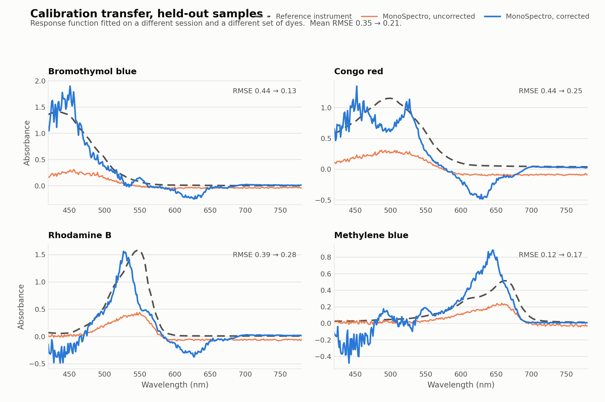
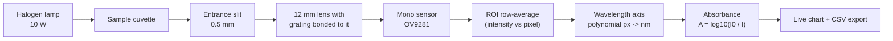
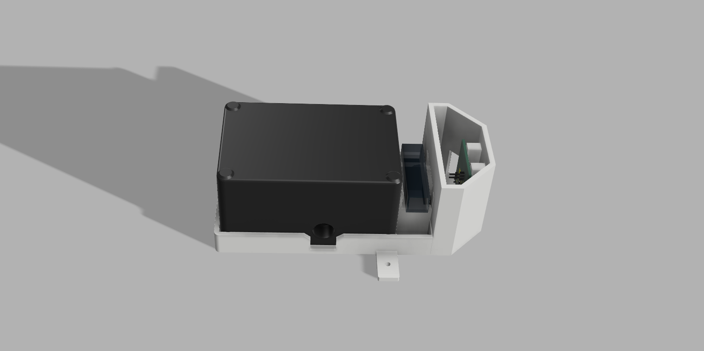
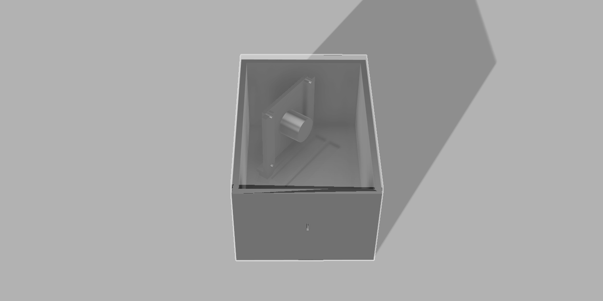

<h1 align="center">MonoSpectro</h1>

<p align="center">
  <b>An open-source visible-light spectrophotometer built around a monochrome Raspberry Pi camera,<br>
  with a calibration validated against a commercial lab instrument on samples it had never seen.</b>
</p>

<p align="center">
  
  
  
  
</p>

<!-- TODO: hero photo of the finished instrument -> docs/images/hero.jpg
<p align="center"></p>
-->

---

## What this is

MonoSpectro turns a monochrome Raspberry Pi camera and a 1000 lines/mm transmission
grating into a working **absorbance spectrophotometer** for the visible range. Light
passes through the sample, is dispersed across the camera sensor, and a browser
interface reads out the spectrum live, lets you take a blank reference, and exports
absorbance as CSV.

It exists for a specific job: **measuring chlorophyll in water from a buoy**. That
constraint drives every design decision here — it has to be cheap enough to leave
outdoors, run unattended off a Raspberry Pi, and be serviced by whoever is on the boat
that day. A lab spectrophotometer is none of those things.

The interesting part is therefore not the optics — plenty of DIY spectrometers exist.
It is the **calibration pipeline**: MonoSpectro maps its own pixel/intensity space onto
the wavelength and absorbance scale of a reference instrument, so the numbers it
produces are comparable to a real lab spectrophotometer instead of being arbitrary
units.

### Where this is going

The end goal is a **spectrofluorometer** in a cross-shaped geometry: a cuvette with four
optical faces, the horizontal axis carrying a white LED and this monochrome camera for
absorbance, and the vertical axis carrying excitation LEDs — a 430 nm blue for
chlorophyll — with an 18-channel AS7265x sensor reading the fluorescent emission at
right angles to the excitation beam.

That split is deliberate. Earlier work compared three low-cost platforms (an 18-channel
AS7265x sensor, a Paton Hawksley pocket spectroscope, and a Little Garden
spectrometer) and found the discrete sensor reproducible and robust but coarse, while
imaging systems gave far better spectral fidelity. It also found a strong dependence on
the light source: **imaging systems want a halogen lamp** (continuous spectrum), while
**the AS7265x is more stable under white LEDs**. Each half of the instrument therefore
plays to its own strength — camera for spectral shape, discrete sensor for sensitive
fluorescence quantification.

The camera side is what this repository covers. It is the part that is built.

| | |
| --- | --- |
| **Validated range** | 420–780 nm, held-out validation against a K Lab Alpha |
| **Sensor** | 1280×720 monochrome, global shutter, 8-bit |
| **Grating** | 1000 lines/mm transmission film, first order |
| **Detector** | Camera-based — no moving parts, whole spectrum captured at once |
| **Readout** | Live web interface on the local network |
| **Calibration** | Per-wavelength response function, 40 % held-out error reduction |

## Does it actually work?

Yes, on samples it has never seen.

The correction was fitted on **nine food colourings** measured in April, and then tested
once on **four laboratory dyes** measured in May — a different session, a different
optical configuration, and a completely different set of chemicals. Nothing from the
test set touched the fit.

<p align="center">
  
</p>

| Held-out sample | RMSE uncorrected | RMSE corrected | Change |
| --- | --- | --- | --- |
| Bromothymol blue | 0.440 | 0.133 | −70 % |
| Congo red | 0.440 | 0.254 | −42 % |
| Rhodamine B | 0.389 | 0.280 | −28 % |
| Methylene blue | 0.116 | 0.168 | **+45 %** |
| **Mean** | **0.346** | **0.209** | **−40 %** |

Reproduce it with
[`tools/calibration_transfer.py`](tools/calibration_transfer.py); the reference
instrument is a **K Lab Alpha**, following the standardised solution protocol developed
by Dr. Dayaris Hernández and Dr. Aramis Rivera.

**Methylene blue gets worse, and that is worth saying out loud.** It was already the
closest match before any correction — 0.116, three times better than the others — and
the correction drags it toward the average behaviour of the training set. A response
function fitted on nine samples is a blunt instrument: it helps where the error is
large and can hurt where the instrument already happened to agree.

### What the correction is

A per-wavelength linear response function:

```
A_ref(λ) = a(λ)·A_diy(λ) + b(λ)
```

Gain and offset are fitted independently at every wavelength from the paired
measurements, then smoothed along the wavelength axis so the two curves stay physical
instead of tracking sample noise. The wavelength range, the polynomial degree and the
smoothing window are chosen by leave-one-out **on the training set only**; the held-out
set is scored once, at the end.

Two coefficients per wavelength, each backed by nine observations. That is the whole
model.

### Why not something cleverer

An earlier attempt used PLS regression to map a whole MonoSpectro spectrum onto a whole
reference spectrum. Trained on the same nine pairs and evaluated under the same
protocol, it reduced the held-out error by **4 %**, against 40 % for the response
function.

The reason is worth understanding before you try it yourself. A spectrum-to-spectrum
regression learns the *shapes it was trained on*. Nine samples cannot span the space of
things you might put in a cuvette, so on new chemistry it interpolates between
memorised shapes and gets it wrong. The response function instead learns a property of
the **instrument** — how far its absorbance reading deviates at each wavelength — and
that property does not care what is in the cuvette.

It is also easy to fool yourself here. The same PLS model scored on its own training
data reaches an RMSE of 0.0000 with enough components: with nine samples and eight
latent variables it can reproduce its inputs exactly. That number means nothing. Always
print the do-nothing baseline next to any model score.

### Spectral shape, separately

Independently of the absorbance scale, the *shape* MonoSpectro records tracks the
reference closely. Fitting a single linear factor per sample on the four May dyes gives
r² of 0.98, 0.95, 0.92 and 0.89, with three of the four peak positions within 6 nm
([`tools/compare_reference.py`](tools/compare_reference.py) reproduces this). Getting the
bands in the right place with the right widths is the hard part of building a
spectrometer; the absorbance scale is what the response function then fixes.

## How it works



1. **Capture** — `picamera2` streams frames from the monochrome sensor. No Bayer
   interpolation stands between the light and the numbers, which is the main reason for
   choosing a mono camera over a colour one.
2. **ROI** — you draw a rectangle over the spectral line. Every column inside it is
   averaged vertically, giving one intensity value per pixel column.
3. **Wavelength axis** — a 1st or 2nd degree polynomial maps pixel position to
   nanometres. Coefficients live in `calibration.json`.
4. **Absorbance** — capture a blank (`Blanco`) to store *I₀*, then every subsequent
   frame is reported as `A = log10(I₀ / I)`.
5. **Export** — `Guardar Abs` downloads a CSV with `Pixel, Wavelength_nm, abs`.

## Hardware

<!-- PENDIENTE render del conjunto
<p align="center">
  
</p>
-->

| Part | Spec | Notes |
| --- | --- | --- |
| Camera | [Arducam OV9281](https://eu.robotshop.com/products/arducam-ov9281-1mp-mono-global-shutter-noir-mono-mipi-camera-raspberry-pi) — 1 MP mono, global shutter, NoIR, MIPI | True monochrome sensor: every pixel is an unfiltered intensity reading |
| Lens | 12 mm M12 | Chosen over 3 / 3.6 / 6 mm — the narrow field spreads the first order across the full sensor |
| Grating | [Edmund Optics #4621](https://www.edmundoptics.eu/p/25400-linesinch-6quot-x-12quot-sheets-2pack/4621/) — 25,400 lines/inch ≈ **1000 lines/mm** | Transmission film, cut from a 6"×12" sheet and **bonded directly to the lens** |
| Camera tilt | 36° from the slit axis | Places the middle of the visible band on the optical axis |
| Entrance slit | 0.5 mm wide | Sets the spectral resolution together with the dispersion |
| Slit → camera | 5 mm | No collimating optics between them |
| Light source | 10 W halogen lamp | Continuous spectrum across the visible band |
| Cuvette | Standard 10 mm path length | Ordinary lab cuvettes — nothing custom |
| Computer | Raspberry Pi 4 | Runs the Flask app and the camera stack |
| Enclosure | 3D printed, designed in Fusion 360 | Designs in [`hardware/`](hardware/) |

> CAD sources are designed in Fusion 360. Exported STEP/STL files live in
> [`hardware/`](hardware/) so you can print them without a Fusion licence.
> <!-- TODO: export STEP + STL into hardware/ and list them here -->

### Optical layout

<!-- PENDIENTE render del interior
<p align="center">
  
</p>
-->

There is no collimator. The grating sits directly on the lens, and the 0.5 mm slit at
5 mm does the work of defining the beam — a deliberately simple geometry that trades
some throughput for a build anyone can reproduce without an optical bench.

For a 1000 lines/mm grating at normal incidence, the first order lands at:

| λ | 400 nm | 500 nm | 600 nm | 700 nm | 800 nm |
| --- | --- | --- | --- | --- | --- |
| diffraction angle | 23.6° | 30.0° | 36.9° | 44.4° | 53.1° |

which is why tilting the camera 36° puts the middle of the visible band on its axis, and a 12 mm
lens — rather than a wider one — keeps the whole first order on the sensor.

Two things matter more than optical precision here:

- **Light-tightness.** Any stray light reaching the sensor raises the floor of *I* and
  flattens your absorbance peaks. Print the body in opaque filament.
- **The sensor is 8-bit.** Intensity saturates at 255, so set exposure and gain to put
  the brightest part of the blank near — but not at — that ceiling.

> **Known limitation:** the NoIR camera carries no IR-cut filter and the sensor responds
> out to roughly 1000 nm, so near-infrared leaks into the measurement. A BG38 or UG11
> filter would fix it. This build does not have one.

## Known deviations, and why they happen

The wavelength axis is systematically wrong at the blue end and close to right
everywhere else. Against the reference instrument the error runs to tens of nanometres
below 500 nm and settles to roughly 5 nm across green and red. That pattern is not
random noise, and three coupled causes account for it.

**1. The grating is not linear, and the first calibration assumed it was.**
For a transmission grating the first-order maxima follow

```
m·lambda = d·(sin(theta_i) + sin(theta_m))
```

Because the diffraction angle enters through a sine, projecting the spectrum onto a
*flat* sensor makes wavelength a non-linear function of pixel position — and the higher
the line density, the worse it gets. At 1000 lines/mm the non-linearity is most severe
in the blue. The original calibration fitted a straight line, which cannot describe
that. A second-order fit from at least three known lines — the mercury peaks of a
compact fluorescent lamp — is the minimum honest model.

**2. The lens distorts the image.**
The grating is bonded to a commercial M12 lens that was never designed for
spectroscopy, so it carries barrel or pincushion distortion. Real pixel position
deviates radially from the ideal:

```
x' = x·(1 + k1·r^2 + k2·r^4)
```

The effect is worst at the sensor edges — exactly where the blue end of the spectrum
lands. Two ways out: characterise the distortion with a grid target and undo it in
OpenCV before extracting the spectrum, or drop the lens entirely and mount the bare
CMOS sensor against the body with the grating as the only optical element.

**3. The tilted sensor changes magnification across the spectrum.**
With the camera tilted 36°, different wavelengths travel slightly different optical
path lengths to reach the sensor, so the system's effective magnification is not
constant across the spectrum width. A rational function

```
lambda = (A + B·x) / (1 + C·x)
```

fitted by least squares approximates that trigonometry better than a quadratic, because
it can bend asymptotically the way the geometry actually does.

None of these is fixed yet. They are written down because anyone reproducing this build
will meet the same three problems, and knowing which one you are looking at is most of
the work.

## Install

On the Raspberry Pi (tested on Raspberry Pi OS *trixie*, Python 3.13):

```bash
# picamera2 comes from the OS, not from pip
sudo apt update && sudo apt install -y python3-picamera2

git clone https://github.com/alexmanuel27/MonoSpectro.git
cd MonoSpectro

python3 -m venv venv --system-site-packages   # so the venv can see picamera2
source venv/bin/activate
pip install -r requirements.txt

cp calibration.example.json calibration.json  # placeholder until you calibrate
python app.py
```

`--system-site-packages` is not optional: `picamera2` is not installable from PyPI, so
an isolated virtualenv cannot see the camera at all.

Then open `http://<your-pi-address>:5000` from any machine on the same network. The Pi
can also serve as its own access point, so the instrument needs no infrastructure in the
field — see [docs/software.md](docs/software.md) for that and for the systemd unit that
starts it on boot.

> One thing to fix before taking it anywhere without internet: `templates/index.html`
> loads Chart.js from a CDN, so in access-point mode the chart never renders. Save
> `chart.umd.js` into `static/chart.min.js` while the Pi is still online and point the
> tag at the local copy.

For the desktop-side analysis tools:

```bash
pip install -r tools/requirements.txt
```

## Using it

> Full walkthrough of the interface, both calibration methods, the HTTP API and the
> field setup: **[docs/software.md](docs/software.md)**.

1. **Frame the spectrum.** Adjust exposure and gain in the sidebar until the spectral
   line is bright but not clipped, then set the ROI (`x;y` for the top-left and
   bottom-right corners) so the green box hugs the line.
2. **Calibrate the wavelength axis** (one of the two methods below).
3. **Take a blank.** Fill the cuvette with your solvent, press `Blanco`.
4. **Measure.** Swap in the sample, press `Guardar Abs` to download the spectrum.

### Calibration method 1 — known peaks

Enable `Calibrar Picos`, click on a peak in the live chart, and type its known
wavelength. Two points give a linear fit; four or more switch to a quadratic. Good
sources of known lines: a compact fluorescent lamp (mercury lines at 436, 546 and
611 nm) or any laser pointer with a specified wavelength.

### Calibration method 2 — sample sync against a reference instrument

Press `Sincronizar` and upload pairs of files: your own exported CSV alongside the
same sample measured on a reference spectrophotometer. MonoSpectro finds the
absorbance maximum in each (smoothed with a 25-point rolling mean), pairs
*your pixel* with *their nanometre*, and fits the axis to it. Six or more pairs
enable the quadratic fit; a sanity check rejects any fit that maps pixel 600 outside
200–1100 nm.

## Data format

Exported spectra:

```csv
Pixel,Wavelength_nm,abs
100.00,401.23,0.0389
101.00,402.31,0.0512
```

`calibration.json` holds the pixel→nm polynomial, highest degree first:

```json
{"coeffs": [0.000378, 1.0814, 41.377]}
```

This file is **device-specific** and gitignored — yours will differ from the example.

## Repository layout

```
├── app.py                     # Flask server: camera stream, spectrum, calibration
├── templates/index.html       # Web interface
├── static/                    # Front-end logic and styling
├── tools/
│   ├── calibration_transfer.py  # Fit and validate the response correction
│   └── compare_reference.py     # Raw shape comparison against a reference
├── hardware/                  # 3D-printable enclosure (STEP / STL)
├── docs/
│   ├── software.md            # Full guide to the interface and the API
│   └── images/                # Figures, renders and screenshots
└── calibration.example.json   # Starting point for your own calibration
```

Raw measurement data is deliberately **not** tracked in this repository — only the
processed figures are.

## Roadmap

- [ ] More training pairs — nine samples is thin for a response function, and
      it currently hurts samples the instrument already read well
- [ ] Publish the enclosure CAD (STEP + STL) and a full bill of materials
- [ ] Fluorescence mode — 430 nm blue LED excitation for chlorophyll, emission read
      near 685 nm by the AS7265x. This is what the instrument was built for
- [ ] IR-cut filter (BG38 / UG11) to stop NIR leakage through the NoIR sensor
- [ ] Dark-frame subtraction to compensate sensor noise at long exposures
- [ ] Save/load named calibration profiles instead of a single global file
- [ ] Store measurement sessions server-side instead of one-shot CSV downloads
- [ ] Transmittance and concentration (Beer–Lambert) readouts
- [ ] English translation of the web interface

## Contributing

Issues and pull requests are welcome — especially calibration data from other builds,
alternative gratings, and enclosure remixes. If you build one, open an issue with
photos and your calibration coefficients; a comparison across builds would be far more
useful than a single unit's numbers.

## License

[MIT](LICENSE) © Alex Manuel Rivera

## Disclaimer

MonoSpectro is a hobbyist and educational instrument. It is not certified for
clinical, diagnostic, food-safety, environmental-compliance or any other regulated
analytical use.
