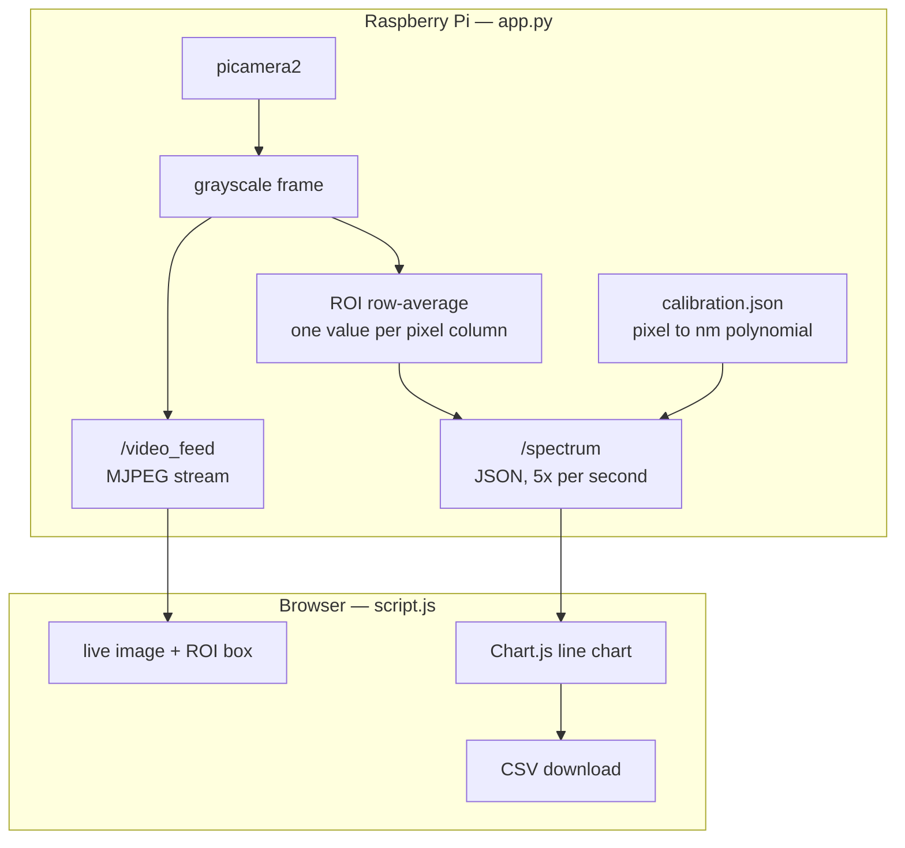

# The software

MonoSpectro runs as a small Flask server on the Raspberry Pi and is driven entirely from
a browser on the same network. Nothing is installed on the client — you point a laptop,
tablet or phone at the Pi and you are looking at the instrument.

<p align="center">
  
</p>

---

## How it is put together



The Pi keeps two pieces of state across restarts: `calibration.json`, the
pixel-to-nanometre polynomial, and `roi.json`, the selected region. Both are written
atomically, and `roi.json` is only rewritten when the value actually changes — the
browser posts its ROI five times a second, and writing that to an SD card every time
wears the card out for nothing.

The blank reference and any calibration points you are part-way through marking live in
the browser tab and are gone when you reload. That is worth knowing before you close it.

The browser polls `/spectrum` every 200 ms and redraws. The camera image arrives
separately as an MJPEG stream, so the video and the chart are independent: if the chart
freezes, the stream will usually keep running, and vice versa.

---

## The screen, region by region

### The camera view

<p align="center">
  
</p>

The live grayscale image from the OV9281. The dispersed spectrum appears as a bright
horizontal streak. The green rectangle is the **ROI** — the only part of the sensor that
becomes data.

Every column of pixels inside the rectangle is averaged vertically, producing one
intensity value per column. Averaging is what buys the signal-to-noise: a 120-pixel-tall
ROI averages 120 samples per wavelength.

Set it with the two text boxes, as `x;y` for the top-left corner and `x;y` for the
bottom-right, then press **ROI**:

| Box | Meaning | Default |
| --- | --- | --- |
| Corner 1 | `x;y` — one corner | `100;300` |
| Corner 2 | `x;y` — the opposite corner | `1100;420` |

Corners are sorted and clamped to the sensor, so you cannot invert or overflow the
rectangle by typing it backwards.

Make the box hug the streak. Too tall and you average in dark rows, which drags the
whole spectrum down and flattens your peaks. Too short and you throw away signal.

> **Changing the ROI invalidates your blank.** The pixel axis is built with
> `linspace(x1, x2, n)`, so moving the rectangle changes both how many points the
> spectrum has and which wavelength each one is assigned. The interface discards the
> stored blank and disables *Save Abs* when you apply a new ROI — set the rectangle
> first, take the blank second.

### The chart

The green trace is the live spectrum: wavelength on X, raw intensity 0–255 on Y. Red
dots are calibration points you have picked.

**Y saturates at 255.** The sensor is 8 bits, so a peak sitting flat at 255 is clipped
and its true height is unknown — and any absorbance computed from it is wrong. Use
exposure and gain to put the brightest part of your *blank* just below the ceiling.

### The sidebar

**Exposure** and **Gain** are sent straight to the camera via `picamera2`. Each has a
slider and a number box, wired together — drag for a sweep, type for a value you want to
reproduce later. Writes are debounced, so dragging does not flood the Pi.

| Control | What it does | Cost of turning it up |
| --- | --- | --- |
| Exposure | exposure time, in milliseconds | Slower refresh; motion blur is irrelevant here, so this is the one to raise first |
| Gain | analogue gain | Amplifies signal *and* noise — raise only after exposure is exhausted |

**Curve smoothing**, in the **Display** card, runs a centred moving average over the
chart trace only — a window of 1 shows the raw signal, larger odd windows (up to 25)
flatten pixel-to-pixel noise for a cleaner picture. It is purely cosmetic and entirely
client-side: `currentI`, the readout, and the *Save Abs* CSV export always use the raw,
unsmoothed values, so smoothing the display can never quietly change your data.

**Calibration** shows whether a fit is loaded and prints the polynomial actually in
use — `λ = 1.1319·x - 40.8819 nm` — so you can see at a glance what the axis is doing.
**Clear calibration** deletes `calibration.json` and falls back to the generic axis.

**Marked points** lists the calibration points you have picked, each removable
individually, with **Calculate** to fit them and **Clear** to start over.

If the camera fails to start, a red banner appears above the video with the actual
exception instead of leaving you looking at a black rectangle.

---

## Taking a measurement

The order matters. The blank has to be taken under exactly the conditions the sample
will be measured in — same exposure, same gain, same ROI.

1. **Frame it.** Put the blank in the beam, set the ROI over the streak, adjust exposure
   and gain until the brightest point sits just under 255.
2. **Calibrate the wavelength axis**, if you have not already. Both methods are below.
3. **Blank.** With the solvent-only cuvette in place, press it. The current spectrum is
   stored in memory as *I₀*, and *Save Abs* unlocks.
4. **Save Abs.** Swap in the sample and press it. Your browser downloads a CSV.

Absorbance is computed in the browser, per point:

```js
A = log10( max(I0, 1) / max(I, 1) )
```

The `max(…, 1)` guards against a division by zero on dead pixels. It also means a truly
black pixel reports `log10(I0)` rather than infinity — a ceiling, not an error.

The file is named `abs_<date>_<time>.csv` and lands in your browser's download folder,
**not on the Pi**. Rename it to something meaningful straight away; a folder of
timestamps is unusable a month later.

```csv
Pixel,Wavelength_nm,abs
100.00,401.23,0.0389
101.00,402.31,0.0512
```

> **Save Abs refuses to run without a blank.** That is deliberate — there is no
> sensible absorbance without a reference.

---

## Calibrating the wavelength axis

Out of the box the X axis is a guess: a straight line from 350 to 750 nm across the ROI.
It is a placeholder, not a measurement. Both methods below replace it with a polynomial
fitted from real reference points, saved to `calibration.json` and reloaded on every
start.

### Method 1 — known emission lines

<p align="center">
  
</p>

1. Shine a source with known lines through the instrument. A compact fluorescent lamp is
   ideal — its mercury lines at **436, 546 and 611 nm** are sharp and unmistakable.
2. Press **Calibrate on chart**. The chart border turns pink and the button reads
   `Click on the peaks`.
3. Click a peak. A prompt shows the pixel position and asks for the wavelength in nm.
4. Repeat for every line you can identify. They appear in the sidebar as `pixel -> nm`.
5. Press **Calculate**.

The fit degree adapts to how much you gave it:

| Points | Fit |
| --- | --- |
| 2–3 | 1st degree — a straight line |
| 4 or more | 2nd degree — a parabola |

Two points is the minimum and it is not enough: a straight line cannot describe a
grating (see *Known deviations* in the main README). Three mercury lines and a laser
pointer is a much better afternoon's work.

A fit that maps the middle of the sensor outside 200–1100 nm is rejected with a message
rather than saved — that catches the degenerate fits that would otherwise leave you with
a silently nonsensical axis. The page reloads when a fit is accepted.

### Method 2 — sync against a reference instrument

Press **Sync** to open the pairing dialog. Each row takes two files for the same
sample: your own exported CSV, and that sample measured on a reference
spectrophotometer.

For each pair the server:

1. Smooths both curves with a 25-point centred rolling mean — raw peaks are too noisy to
   trust a single maximum.
2. Takes the position of the maximum in each: a **pixel** from yours, a **nanometre**
   from theirs.
3. Averages the pixel values of any samples that report the same reference wavelength,
   so two dyes peaking at the same place cannot pull the fit in two directions at once.
4. Fits the collected `(pixel, nm)` pairs.

| Pairs | Fit |
| --- | --- |
| fewer than 6 | 1st degree — forced, to stop the axis exploding |
| 6 or more | 2nd degree |

The same sanity check applies. Pairs that fail to parse are skipped and reported back by
name instead of vanishing silently, so you can see which file was the problem.

The commercial file is read with `skiprows=7`, wavelength from column 0 and absorbance
from column 2, and both `.csv` and `.xls`/`.xlsx` are accepted. If your instrument
exports a different shape, that is the line to change.

> **Pick samples whose peaks are spread out.** Eleven dyes that all absorb between 490
> and 500 nm give you one calibration point, not eleven. Aim to cover 420–700 nm.

---

## Running it as a field instrument

The Pi can be its own access point, so the instrument needs no infrastructure — power it
up on a boat or a bench and connect to it directly.

```bash
sudo nmcli con add type wifi ifname wlan0 con-name MonoSpectro autoconnect yes \
  ssid MonoSpectro
sudo nmcli con modify MonoSpectro 802-11-wireless.mode ap \
  802-11-wireless.band bg ipv4.method shared
sudo nmcli con modify MonoSpectro wifi-sec.key-mgmt wpa-psk
sudo nmcli con modify MonoSpectro wifi-sec.psk "12345678"
sudo nmcli con up MonoSpectro
```

Join the `MonoSpectro` network and the interface is at **http://10.42.0.1:5000**.

Chart.js is vendored at `static/chart.min.js` rather than pulled from a CDN, precisely
so the chart still renders when the Pi is its own access point with no route to the
internet.

To start on boot, `/etc/systemd/system/monospectro.service`:

```ini
[Unit]
Description=MonoSpectro web server
After=network.target

[Service]
User=alex
WorkingDirectory=/home/alex/spectro_web
ExecStart=/home/alex/spectro_web/venv/bin/python app.py
Restart=always
RestartSec=5

[Install]
WantedBy=multi-user.target
```

```bash
sudo systemctl daemon-reload
sudo systemctl enable --now monospectro.service
journalctl -u monospectro.service -f     # logs
```

---

## HTTP endpoints

Useful if you want to script the instrument instead of clicking it.

| Method | Route | Body | Returns |
| --- | --- | --- | --- |
| GET | `/` | — | the interface |
| GET | `/video_feed` | — | MJPEG stream, grayscale, JPEG quality 70 |
| POST | `/spectrum` | `{"selection": {x1,y1,x2,y2}}`, optional | `{wavelengths, intensities, pixels, is_calibrated, coeffs, roi, camera_error}` |
| POST | `/calibrate_manual` | `{"points": [{pixel, wavelength}, …]}` | `{"status", "coeffs", "degree"}` |
| POST | `/calibrate_samples` | multipart: `diy_0`, `com_0`, `diy_1`, … | `{"status", "count", "degree", "coeffs", "skipped"}` |
| POST | `/delete_calibration` | — | `{"status": "success"}` |
| POST | `/set_control` | `{"control": "exposure"\|"gain", "value": n}` | `{"status": "success"}` |

`/spectrum` doubles as the ROI setter — posting a `selection` validates it, clamps it to
the sensor and updates the video thread too; an invalid rectangle comes back as a 400
with the reason. There is no authentication of any kind; this is a local-network
instrument, not a service to put on the internet.

---

## When something looks wrong

| Symptom | Likely cause |
| --- | --- |
| Red banner above the video | The camera failed to start; the banner carries the exception |
| Video black, no banner | Camera streaming but nothing reaching it. Check the lamp and the light path |
| Green box not on the spectral line | Adjust the ROI. The box is drawn from the real rendered geometry, so where you see it is where it reads |
| Flat trace pinned at 255 | Saturated. Drop exposure, then gain |
| Peaks in the right place, absorbance too low | ROI includes dark rows above or below the streak |
| Absorbance negative | Blank was dimmer than the sample — usually the blank was taken at a different exposure |
| *Save Abs* greyed out | No blank yet, or the ROI changed since you took one |
| Wavelengths wildly wrong after Sync | Too few pairs, or several samples peaking at the same wavelength |
